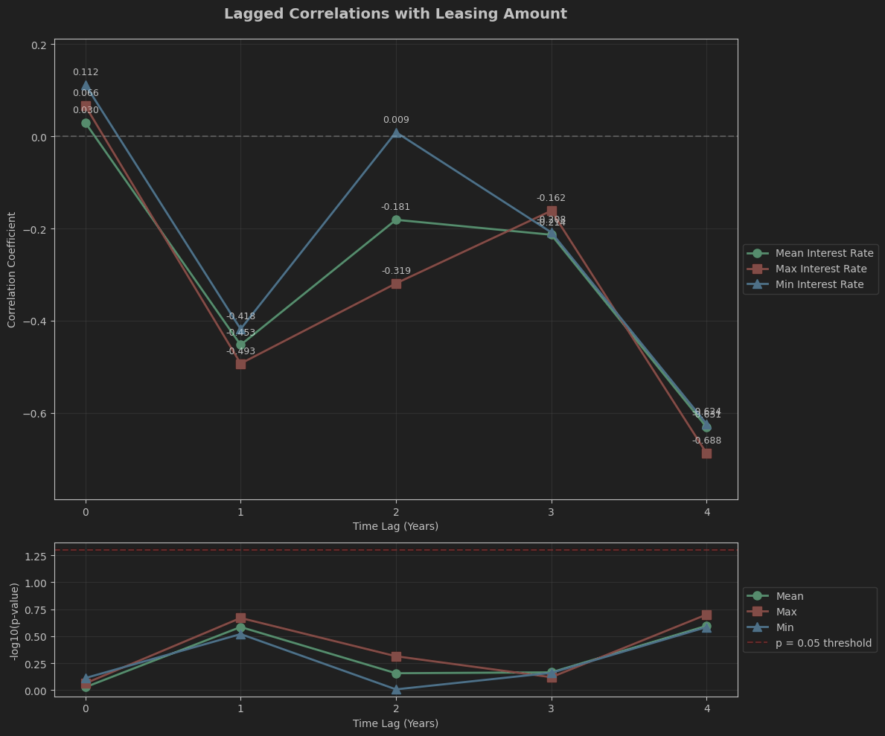

# Atea leasing assignment

## How to Run

Just clone the repo, install the dependencies, and run it.

```shell
git clone git@github.com:JaneSul/atea-finance-case.git
cd atea-finance-case
pip install -r requirements.txt
```

##  Exploratory Data Analysis (EDA)

 1. Individual Feature Review: Examine each variable independently to grasp its distribution and essence.
 2. Feature Relationships: Investigate how variables interact and relate to each other through various analytical techniques.
 3. Identifying Outliers: Detect and strategize on how to handle data anomalies.
 4. Creative Feature Engineering: Enhance the dataset with new or transformed features based on EDA findings.


## Exploring correlation between the interest rate and leasing of office equipment
There is no significant correlation between interest rates data and the leasing of office equipment. The relationship appears to be random.

## Exploring Lagged correlation
### 
Exploring lagged correlation between the leasing amount the interest rates, since there was no strong correlations detected. As well as that many businesses plan their leasing decisions annually. A lag analysis can show if companies make decisions on historical interest rates rather than current ones.

### Results
The results indicate a strong lagged correlation with the previous year, a lag of 1 year. 

A **moderate negative correlation with the previous year's interest rate**, meaning there is a decrease in leasing volume for the following year.

This could be used to forecast next year’s leasing activity. 

[](docs/lagged_corr.png)

## Observations
1.	Looking into the growth rates (in percentage) across different leasing categories shows relative stability of most leasing categories except for Buildings/Real Estate, which experienced exceptional but temporary growth spikes.
2.	Leasing for industrial machinery shows steadier trends, reflecting stable industrial investments with less sensitivity to short-term market conditions.
3.	Differences in growth rates between the categories may be influenced by varying financing terms or policy changes impacting office equipment more than industrial machinery.
4.	There is no significant correlation between interest rates data and the leasing of office equipment. The relationship appears to be random.
5.	The results of lagged correlations, while the -0.418 correlation at Lag 1 might seem noteworthy at first glance, the high p-value (0.302) means we cannot conclude there is a meaningful lagged relationship between interest rates and office equipment leasing. Any apparent relationship could be due to random variation in the data.
6.	Office equipment leasing decisions are primarily driven by factors other than interest rates (such as business needs, technology cycles, or regulatory requirements). This suggests interest rates might be a secondary consideration in leasing decisions

## Further questions:

- What is the correlation between this trend and inflation rates during the same period?
- How has this interest rate trend impacted lending and borrowing behavior in specific sectors?
- Could further rate hikes or reductions be expected based on macroeconomic indicators?

